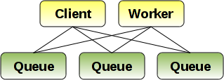
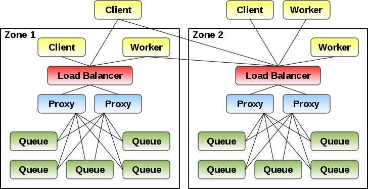

..
  Copyright (C) 2011 OpenStack Foundation
 
  Licensed under the Apache License, Version 2.0 (the "License");
  you may not use this file except in compliance with the License.
  You may obtain a copy of the License at
 
      http://www.apache.org/licenses/LICENSE-2.0
 
  Unless required by applicable law or agreed to in writing, software
  distributed under the License is distributed on an "AS IS" BASIS,
  WITHOUT WARRANTIES OR CONDITIONS OF ANY KIND, either express or implied.
  See the License for the specific language governing permissions and
  limitations under the License.

Examples
********

Client Usage Examples
=====================

These examples are demonstrated using the REST API, but they could
be performed with any other supported client protocol or API.

Basic Asynchronous Queue
------------------------

Multiple workers long-poll for messages until a client inserts
one. Both workers tell the server to hide the message once it is read
so only one worker will be able to see the message. The POST request
from a worker is an atomic get/set operation.

Worker1: long-polling worker, request blocks until a message is ready

``POST /account/queue?limit=1&wait=60&hide=60&detail=all``

Worker2: long-polling worker, request blocks until a message is ready

``POST /account/queue?limit=1&wait=60&hide=60&detail=all``

Client: insert message

``PUT /account/queue/id``

Worker1: Return from the blocking POST request with the new message
and process it

Worker1: delete message once it is done processing

``DELETE /account/queue/id``

If Worker1 crashes or takes longer than 60 seconds to process the
message, the hide time will expire on the server and message will
reappear. At this point another worker waiting for messages (such as
Worker2) will return with the message. If Worker1 doesn't crash but
needs more time, it can update the message with a longer hide time
to ensure another worker doesn't get a chance to process it.

Fast Asynchronous Queue
-----------------------

In this example message loss is acceptable and workers have the ability
to do batch-processing (process multiple messages at once). Workers
grab up to 100 messages at a time and tell the server to remove the
messages as they are returned. If a worker crashes after the server
returns them but before they were successfully processed, they
are lost. The DELETE request from a worker is an atomic get/delete
operation.

Worker1: long-polling worker, request blocks until a message is ready

``DELETE /account/queue?limit=100&wait=60&detail=all``

Worker2: long-polling worker, request blocks until a message is ready

``DELETE /account/queue?limit=100&wait=60&detail=all``

Client: insert messages::

    PUT /account/queue/id1
    PUT /account/queue/id2
    PUT /account/queue/id3
    ...

Worker1: Return from the blocking DELETE request with all new messages
and process them

Worker2: Return from the blocking DELETE request as more messages
are inserted that were not returned to Worker1

Multi-cast Event Notifications
------------------------------

This type of messages access allows multiple workers to read the same
message since the message is not hidden or removed by any worker. The
server will automatically remove the message once the message TTL
has expired.

Worker1:

``GET /account/queue?wait=60``

Worker2:

``GET /account/queue?wait=60``

Client:

``PUT /account/queue/id1?ttl=60``

Worker1: Return from blocking GET request with message id1

Worker2: Return from blocking GET request with message id1

Worker1:

``GET /account/queue?wait=60&marker=id1``

Worker2:

``GET /account/queue?wait=60&marker=id1``

The ``marker`` parameter is used to let the server know the last ID
that was seen by the worker. Only messages with IDs inserted after
this marker will be returned for that request.

Deployment Examples
===================

Configuration of the queue service will be flexible and this section
describes three sample deployments. Each of the queue servers (green
boxes) can optionally have persistence configured for them. Note that
queue servers should not share the same backend storage unless the
backend-storage is suitable for the HA needs of the deployment. The
queue servers will not know of or coordinate with one another in
any way, the clients and workers (or proxy, in the last example) are
responsible for balancing the load between available queue servers
and failing over to another server if one goes down.

Developer
---------

In this deployment, a single queue server is run, and all clients
and workers connect to it.

Simple HA
---------

In this deployment, multiple queue servers are run and all clients
and workers are given the list of IP addresses for the available
queue workers. Clients should either connect to the first available
server, or if it wants to distribute load amongst all three, should
use some algorithm depending on message. If all messages are unique,
a simple round-robin distribution may be sufficient. For messages with
client-side IDs that could possibly have duplicates, the client should
use a hashing algorithm on the ID to ensure the same ID hits the same
server. This allows the queue services to coalesce all messages with
the same ID. Should a queue server go down, the clients can simply
re-balance to the new server set. Workers should poll or remain
connected to all queue servers to ensure it can pull a message no
mater where it is inserted.

Public Cloud Service
--------------------

In this deployment, proxy servers are placed in front of each cluster
of queue servers. The proxy servers manage spreading the load across
the queue cluster instead of relying on the clients and workers to
manage multiple connections. This is only suitable when your proxy
servers are configured in a redundantly (such as when using a HA load
balancer). For a given account ID, all proxy servers in a zone should
hash to the same subset of queue workers (with a default max of three),
and use that set to spread load across. This is similar to how Swift
spreads objects based on the placement in the hash ring. Once the
account ID determines the set of queue servers to use, the queue
name and message ID (other components of the unique message ID) will
determine which queue server in the set to use. The algorithm used in
the proxy should be modular, so you can easily alter how many queue
servers to use for an account, and how to distribute to them within
that set.

For example, if a client creates a message with ID
/account_1/queue_A/msg_123, the proxy server will parse out the
"account_1" component and use that in the hashing algorithm to get a
set of queue servers (lets say it returns the set qs1, qs4, qs5). With
this set, the proxy then hashes the rest of the ID "queue_A/msg_123" to
determine which queue server to proxy to (lets say it maps to qs4). If
a message comes in with the exact same ID, the same algorithm is used
to proxy it to the same queue server, possibly allowing the queue
server to coalesces the message so it is processed by a worker only
once (eliminating the thundering herd problem). If a queue server in
the returned set should fail, it can either run with two servers or
choose a third server until the original node comes back up.

When the proxy is handling worker requests it will use the same
hashing algorithms. When a worker GETs a queue name to read messages,
the account portion is parsed and a connection is made to all queue
servers. It will then aggregate messages from all queue servers
handling that account into one view for the worker to consume. The
proxy and queue servers may need to use a more efficient multiplexing
protocol that can keep state for multiple accounts and requests
rather than simple REST based calls to keep the number of connections
reasonable.
