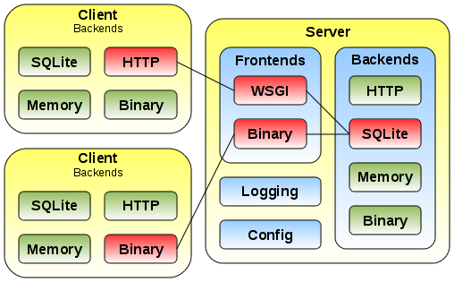
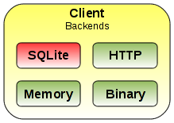

..
  Copyright (C) 2011 OpenStack LLC.
 
  Licensed under the Apache License, Version 2.0 (the "License");
  you may not use this file except in compliance with the License.
  You may obtain a copy of the License at
 
      http://www.apache.org/licenses/LICENSE-2.0
 
  Unless required by applicable law or agreed to in writing, software
  distributed under the License is distributed on an "AS IS" BASIS,
  WITHOUT WARRANTIES OR CONDITIONS OF ANY KIND, either express or implied.
  See the License for the specific language governing permissions and
  limitations under the License.

Overview of Burrow
******************

Why Burrow?
===========

The reason for initiating a new project vs using an existing one is
due to simplicity, modularity, and scale. Very few (if any) existing
message queue systems out there were built with multi-tenant cloud
use cases in mind. Very few also have a simple and extensible API and
storage backend. There are possible solutions to build an AMQP based
service, but current versions of AMQP bring complexity and a protocol
not optimized for high latency and intermittent connectivity. The
benefits and constraints of a distributed, multi-tenant environment
(cloud services) requires a different approach than single tenant or
clustered services.

Key Features
============

* **Simple** - The queue constructs are very basic in order to expose
  a simple API. This allows easy access for users from any
  language. The service does not require much setup before applications
  can start inserting messages into it.

* **Modular** - There are not any first-class frontend or backends,
  all modules implement the same interface and can interoperate with
  one another. It is possible to easily add other frontend API modules
  (AMQP, JMS, Gearman, etc) or backend storage modules if one does
  not meet a particular use case. Note that the internal API will
  not always provide a 1-1 mapping with the external API due to its
  simplicity, so some features with certain protocol modules may
  be unavailable.

* **Persistent** - Messages may optionally be persistent depending
  on the backend being used. For protocols that can support it,
  an optional flag can be sent to choose the appropriate backend.

* **Multi-tenant** - Multiple accounts for the service are supported
  and will scale horizontally to a large number of accounts. There
  are protections in place for potentially malicious users as well. *

* **Fast** - Since this is a building block for other services that may
  drive heavy throughput, performance is critical. Performance will
  also not suffer during horizontal scaleout or failover for large
  deployments either. *

* **No Single Point of Failure** - The service can be configured to be
  highly available so there is no single point of failure. There may
  be additional measures to be taken depending on the storage backend
  being used. *

`*` (This is a work-in-progress and will have more focus in a future
release).

Components
==========

Typical uses of Burrow will include clients, servers, and possibly a
proxy, although it is possible to use only clients with a backend for
local or in-process queues. Regardless of the frontends and backends
used for clients, servers, or proxies, the APIs all boil down to the
same core interface and data types.

A client can also be broken into two common patterns, either a producer
or a consumer (also known as a worker). Producers primarily insert
messages into the queue and consumers will pull messages out. In
Burrow, there are not different types for producers and consumers,
there are simply clients which can manipulate the queue (inserting,
listing, updating, or removing).

Data Types
----------

External APIs (especially the native Burrow APIs) and the internal
API between frontends and backends are very simple and consists of
a handful of methods using only a few data types. Top level methods
include listing and deleting accounts. Beyond this, data types and
methods are:

Account
^^^^^^^

Accounts represents a user, application, or some other account
context. Every queue and message is associated with an account,
and when listing an account, a list of queues containing messages
is returned.

Accounts support listing and deleting of queues within them. Note that
deleting a queue in an account is really an operation that deletes
all messages for that queue, and the queue is automatically removed
when no more messages exist for it.

Queue
^^^^^

A queue is simply a namespace, they are not explicitly created,
deleted, and do not have metadata associated with it. Queue names are
unique within an account context. They automatically appear when a
message exists for the queue name and are automatically removed when
all messages for a given queue name are deleted.

Queues support listing, deleting, and updating of messages inside the
queue. When updating multiple messages in a queue, only attributes
are supported. Queue updates do not modify message IDs or bodies.

Message
^^^^^^^

A message consists of a unique ID, attributes, and a body. The
unique ID is composed of the account, queue name, and a message
ID. A server will only contain a single message for a given unique
ID. If two messages are inserted with the same unique ID, the last
one overwrites the first.

Messages can be created, listed, deleted, and updated. A message may be
created multiple times, and the last version written "wins". Message
updates are only for attributes just like queue updates, to change
the body you must recreate the message with the same ID.

The currently supported message attributes are:

* ttl=SECONDS - How long the message will exist in the queue.

* hide=SECONDS - How long the message should be hidden from list
  requests. This allows for delayed insert of messages and "in
  progress" time when a worker is processing the message but is not
  ready to delete it.

.. _filters:

Filters
^^^^^^^

Methods that support accessing multiple objects (accounts, queues,
or messages) can accept a set of filters to apply. The currently
supported filters are:

* limit=COUNT - Limit the number of matched messages. This allows
  a worker to grab as few or as many messages as it can handle at
  once. For example, a worker resizing images may only grab one at
  a time, but a worker processing log messages may grab many for
  efficient batch processing.

* marker=ID - Only match IDs after the given ID. This allows for
  multi-cast messages by always having a 'hide' attribute value of
  0 and not deleting messages (let the TTL delete them automatically).

* show_hidden=true|false - Whether or not to match messages that are
  currently hidden. The default is false.

* detail=none|id|metadata|all - What details of an object to
  return. The metadata and all options only apply to messages
  currently, which translate to attributes and body.

Design
======

Burrow is extremely modular in its design. The main components are
frontends and backends, with backends being used for both clients and
servers. For example, a SQLite backend module can be used directly
through the client API for local or in-process queues, or it can
sit behind any number of frontends when used with the server. Most
clients will use a socket-based backend such as the HTTP module so
it can communicate with a remote server.

For example, the image below shows two clients, one using the HTTP
backend and another using a custom binary protocol backend. Both
clients connect to a server instance that has two frontends running,
one for HTTP (via WSGI) and a binary server protocol module. This
server is configured to use the SQLite plugin for the backend.

The next example shows how a client could use the SQLite plugin
directly. This could be useful for local or in-process queues.

Behavior and Constraints
========================

The default queue behavior is FIFO, although LIFO should be a trivial
addition (this will be revisited later). Message insert and retrieval
order is only guaranteed for a single queue server. When used along
with a proxy, or when a client uses multiple queue servers, it is
possible that newer messages from one queue server will be returned
before older messages in another. The proxy server will make a best
effort to drain the queue servers evenly, but strict message ordering
is not guaranteed. Applications that require strict ordering will
need to use another mechanism within messages to guarantee this.

In certain failure scenarios such as a queue server crash, it is
possible, depending on deployment configuration, for messages to either
be lost or duplicated. Lost messages should only happen if they were
inserted with no persistence (such as an in-memory queue or some
other non-persistent backing store). It is up to the deployment to
offer guarantees according to what message persistence modules they
choose to offer. For example, a queue server backed by MySQL will
only be as durable as the MySQL configuration, which can vary from
in-memory only to extremely durable (commit to disk and replicated).

Duplicate messages can happen when a worker pulls a message to
work on, the server crashes, the worker finishes, and the message
delete call fails. When the server comes back up, the message will
appear in the queue again (assuming it was in a persistent message
store). Applications can handle this in a variety of ways, from simply
running the job twice, to rolling back changes on the delete failure,
to tracking unique message IDs to ensure they are processed only once.

A client used with a single proxy server (single IP, may be multiple
servers behind a HA load balancer) will only need to concern itself
with one server and send all messages to it. Clients have the option
to use a list of servers in two ways. For example, the client could
either hash on the message ID and send to the appropriate server
in its hash table (for spreading the load) or treat the list as a
preference for all messages and failover to another server if the
first server is down (for simple HA). It is possible for clients to
do both as well where each entry in a hash table could have a list
of servers for HA. All this depends on the deployment configuration.
